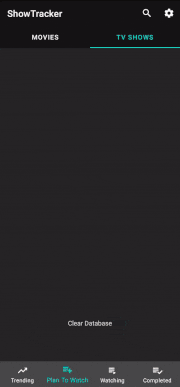

#  

Simple, yet elegant app to manage your TV shows and movies watch history powered by TMDb services.
## Features:
Discover trending movies and TV shows  
Look up detailed information about shows you're interested in  
Sort your shows into 3 different categories  
Export and import your watch history  
More things to come in future updates  
## Build Instructions:
To build this project you have to create an object named "Config" inside utils package and provide your TMDb api key as shown in the picture below  
  
##  Notable Features, Libraries and Frameworks Used:
* Kotlin
* Kotlin Coroutines, Flows
* Android Jetpack: Room, Paging3, ViewBinding, ViewModels
* Retrofit, Glide
* Dependency Injection: Dagger2
* Implemented custom PieChartView 
## Upcoming Features and Updates:
* Divide project into modules
* Notify user about updates for followed shows
* Add more information: actors, seasons, etc.
* General improvements and code refactoring

## Little Demonstration:
Light/Dark Mode  

  

You can export your watch history, clear your database and then import it back  

  
   
  

  

This app saves the date of when you watched an episode of a tv show   

  

## Contact Info:
You can find all the methods of contacting me on my website  
https://flacrow.dev  
or simply send me an email  
mailto:admin@flacrow.dev
